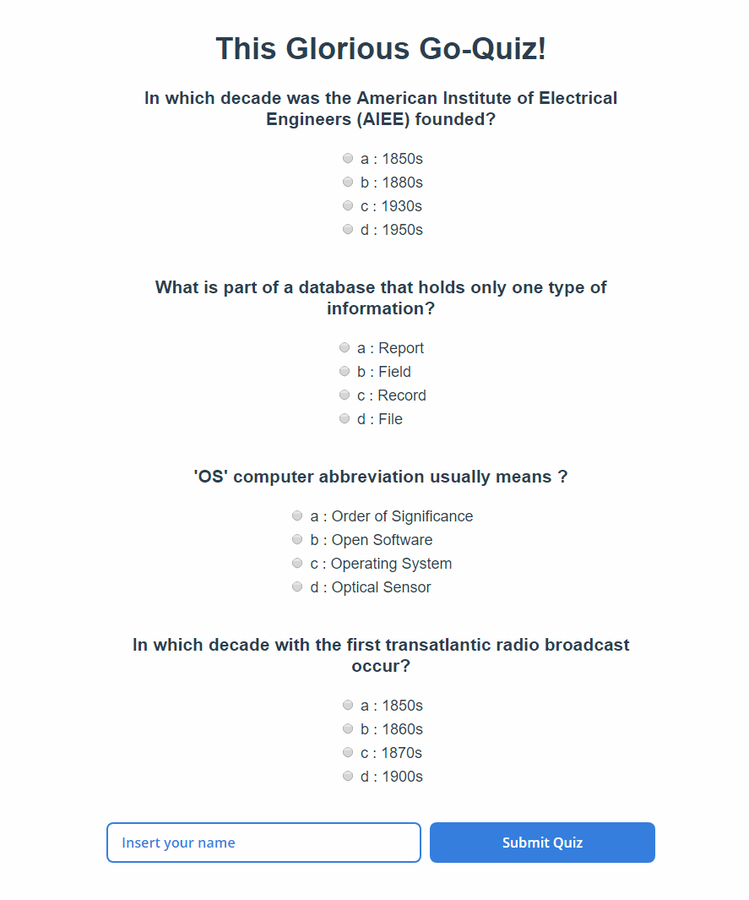

# Quiz

## Instructions

### Development

1. Run `glide install`
2. Run `go build server.go`
3. RUN `./server.go`
4. Open new CMD
5. RUN `cd ./client`
6. RUN `npm i`
7. RUN`npm run dev`

## Todo

* API pagination
* Cache
* Tests
* Fancy UI

## Demo

